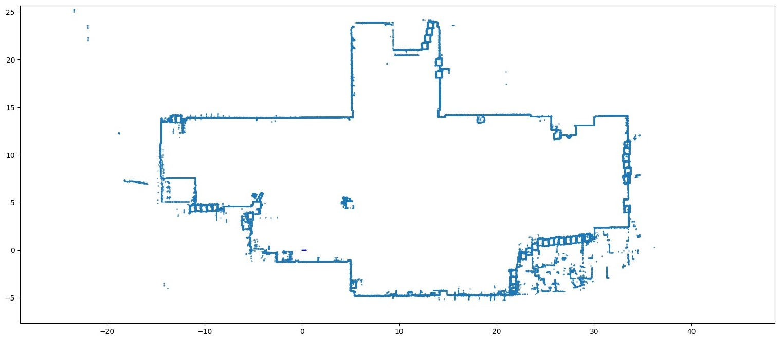
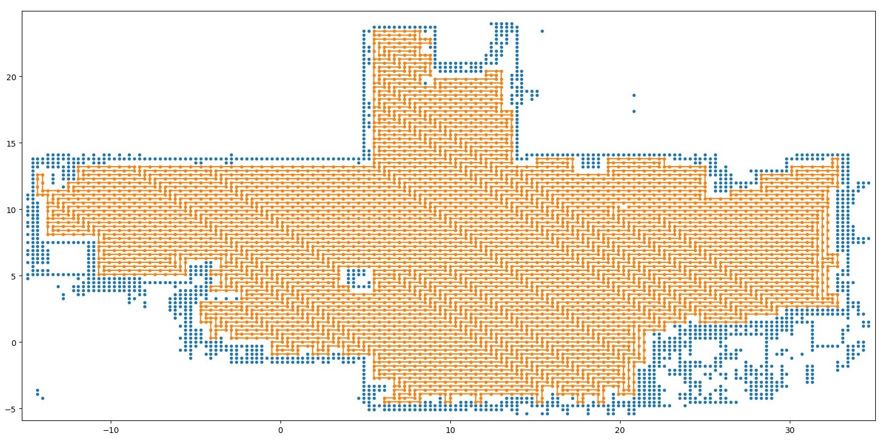

# Spanning-Tree-Covering
A preliminary implementation of Spanning Tree Coverage algorithm. 

一个简单的机器人全覆盖实现，使用了生成树覆盖算法，可以保证在近乎全覆盖地图面积的同时不走回头路，大大提高覆盖效率。后期可以扩展加入动态避障以及对由于算法本身缺陷无法覆盖到的点的覆盖。

下图是某地图的可视化

下图是程序运行结果

## 使用

默认机器人是一个正方形/圆形，直径为 0.3m。如果需要改变它的直径，可以直接修改 `Map.robot_len`。依照下面的指示运行程序后，程序默认展示生成的路径图，路径以一个包含 (x,y) 坐标的数组形式存储在 `result` 中。

Precondition: 要求输入的地图四周确确实实封闭，且机器人在一个封闭区域内。

### SEER smap 格式

1. `Main.py` 中将 `map_path` 改为想要读入的 `smap` 格式文件
2. 将 `planner = PathPlanner(my_map, 20, 10)` 最后两个参数(这个例子中是x坐标为20m,y坐标为10m)改为机器人起始位置的坐标
3. 运行 `Main.py`

### 非 SEER smap 格式

1. 修改 `MapReader.py` 或直接修改 `Map.py`，使 `min_x, min_y, max_x, max_y, blocked[][]`    可以得到正确地初始化
2. 其他步骤同 SEER 2,3

## 鸣谢

- 此程序为在[仙工智能 SEER](https://github.com/seer-robotics/)实习期间完成(7.24 - 8.21)，感谢[黄强盛老师](https://github.com/huangqiangsheng)在期间的指导。

- 感谢 [PythonRobotics](https://github.com/AtsushiSakai/PythonRobotics/blob/master/PathPlanning/SpiralSpanningTreeCPP/spiral_spanning_tree_coverage_path_planner.py) 及 [UIUC Planning Algorithm](http://planning.cs.uiuc.edu/node353.html) 提供主要思路
